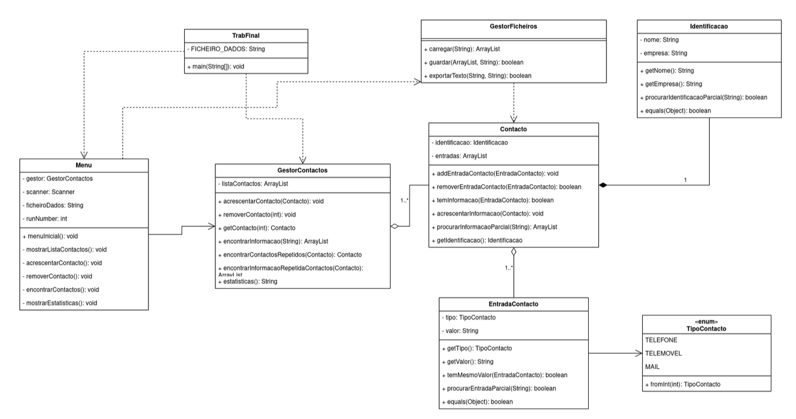

# Manual do Programador: Gestão de Contactos

**Programação Orientada a Objetos (2025/2026)**

> Aluno 1: **Diego Laya**, nº **2025154378**
> Aluno 2: **Luis Junqueira**, nº **2025168125**

---

## 1. Introdução

Aplicação **Java Consola** para gestão de uma agenda de contactos. Permite
listar, acrescentar (garantindo a unicidade da informação), remover (total ou
parcialmente), encontrar e produzir estatísticas. A informação é **lida de um
ficheiro no arranque** e **gravada imediatamente após cada alteração** (e também
ao sair), garantindo que nenhuma alteração se perde mesmo que o programa termine
de forma inesperada.

Dois tipos de contactos:

- **Pessoais**: nome e lista de entradas de contacto.
- **Profissionais**: o anterior e o nome da empresa.

A distinção é feita pela `Identificacao`: empresa vazia indica contacto pessoal;
empresa preenchida indica contacto profissional.

O projeto está organizado como um **projeto NetBeans** (Apache NetBeans): pode ser
aberto diretamente no IDE e executado a partir da classe principal `TrabFinal`. A
informação é guardada no ficheiro **`contactos.txt`** (definido em
`TrabFinal.FICHEIRO_DADOS`), criado na pasta de execução do projeto.

## 2. Arquitetura e relações entre classes



**Separação de responsabilidades (camadas):**

| Camada | Classe(s) | Responsabilidade |
|--------|-----------|------------------|
| Interação | `Menu`, `TrabFinal` | Ler opções do utilizador e mostrar resultados |
| Modelo / negócio | `GestorContactos`, `Contacto`, `Identificacao`, `EntradaContacto`, `TipoContacto` | Guardar e manipular dados; regras de unicidade |
| Persistência | `GestorFicheiros` | Ler/gravar a agenda e exportar listagens |

As classes do modelo **não conhecem** `Scanner` nem `System.out`, e a manipulação
de ficheiros está toda em `GestorFicheiros`. Assim é possível trocar a interface
(ex.: GUI) ou o formato do ficheiro sem alterar o modelo.

## 3. Classes

### 3.1 `TrabFinal` (principal)
Carrega a agenda e arranca o `Menu`, que grava a informação após cada alteração.
- **Atributos:** `FICHEIRO_DADOS: String` (estático).
- **Métodos:** `main(String[]): void`.

### 3.2 `Menu`
Toda a interação com o utilizador.
- **Atributos:** `gestor: GestorContactos`, `scanner: Scanner`, `ficheiroDados: String`.
- **Métodos principais:** `menuInicial(): void` (ciclo), `mostrarListaContactos()`,
  `acrescentarContacto()`, `removerContacto()`, `encontrarContactos()`,
  `mostrarEstatisticas()`. Apoio: `carregarContactos()` (lê do ficheiro no arranque),
  `guardarAgenda()` (grava após cada alteração),
  `perguntarEscreverFicheiro(String)` (exporta listagem), `lerTipoContacto()`.

### 3.3 `GestorContactos`
Lógica de negócio sobre a lista de contactos.
- **Atributos:** `listaContactos: ArrayList<Contacto>`.
- **Métodos principais:**
  - `acrescentarContacto(Contacto): void`, `removerContacto(int): void`, `getContacto(int): Contacto`.
  - `encontrarInformacao(String): ArrayList<Integer>`: índices dos contactos que satisfazem o critério.
  - `encontrarContactosRepetidos(Contacto): Contacto`: deteta identificação duplicada.
  - `encontrarInformacaoRepetidaContactos(Contacto): ArrayList<Contacto>`: deteta informação repetida.
  - `estatisticas(): HashMap<TipoContacto,Integer>`: contagem de entradas por tipo.

### 3.4 `GestorFicheiros` (manipulação de ficheiros)
Classe utilitária (só métodos `static`).
- **Métodos principais:**
  - `carregar(String): ArrayList<Contacto>`: lê o ficheiro de dados (lista vazia se não existir).
  - `guardar(ArrayList<Contacto>, String): boolean`: grava toda a agenda.
  - `exportarTexto(String, String): boolean`: grava uma listagem num ficheiro de texto à escolha.
- **Escrita:** `PrintWriter` → `BufferedWriter` → `FileWriter`; **leitura:**
  `BufferedReader` → `FileReader` (`readLine()`), com o charset por omissão da
  plataforma nos dois sentidos, para leitura e escrita ficarem sempre coerentes.

**Formato do ficheiro de dados** (uma linha por registo, campos separados por TAB):

```
C<TAB>nome<TAB>empresa      (início de um contacto)
E<TAB>TIPO<TAB>valor        (entrada; TIPO = TELEFONE|TELEMOVEL|MAIL)
```

### 3.5 `Contacto`
Uma `Identificacao` e a lista das suas `EntradaContacto`.
- **Atributos:** `identificacao: Identificacao`, `entradas: ArrayList<EntradaContacto>`.
- **Métodos principais:** `addEntradaContacto(EntradaContacto)`,
  `removerEntradaContacto(EntradaContacto): boolean`, `temInformacao(EntradaContacto): boolean`,
  `temAlgumaInformacaoIgual(Contacto): boolean`, `acrescentarInformacao(Contacto)`,
  `procurarInformacaoParcial(String): ArrayList<EntradaContacto>`.

### 3.6 `Identificacao`
- **Atributos:** `nome: String`, `empresa: String` (ambos `final`; `nome` validado não-vazio).
- **Métodos principais:** `getNome()`, `getEmpresa()`,
  `procurarIdentificacaoParcial(String): boolean`, `equals()`/`hashCode()`.

### 3.7 `EntradaContacto`
- **Atributos:** `tipo: TipoContacto`, `valor: String` (validados no construtor).
- **Métodos principais:** `getTipo()`, `getValor()`, `temMesmoValor(EntradaContacto): boolean`,
  `procurarEntradaParcial(String): boolean`, `equals()`/`hashCode()`.

### 3.8 `TipoContacto` (enum)
Valores: `TELEFONE`, `TELEMOVEL`, `MAIL`.
- **Métodos:** `fromInt(int): TipoContacto` (opção 1..3 para o tipo), `toString()` (apresentação com acentos).

## 4. Regras de unicidade (Acrescentar)

1. **Identificação igual** (nome+empresa) a um existente: acrescentar a info ao
   existente, ou desistir.
2. **Informação igual** (telefone/telemóvel/mail) noutros contactos: acrescentar
   a info ao existente, acrescentar o novo, ou desistir.
3. **Informação nova**: o contacto é adicionado.

Dentro do mesmo contacto, `temInformacao`/`acrescentarInformacao` evitam valores repetidos.

## 5. Como estender

- **Novo tipo de contacto** (ex.: `FAX`): acrescentar ao enum `TipoContacto` e
  tratar em `fromInt()`/`toString()`. Estatísticas e persistência adaptam-se.
- **Validação de dados** (ex.: telemóvel = 9 dígitos): acrescentar em
  `EntradaContacto` ou no `Menu`, usando `String.matches` (expressões regulares).
- **Outro formato de ficheiro** (CSV/JSON): alterar apenas `GestorFicheiros`.
- **Importar de um ficheiro à escolha** (funcionalidade futura): acrescentar uma
  opção no menu que permita ao utilizador indicar/escolher o ficheiro de onde
  importar contactos para a agenda, em vez de usar apenas o `contactos.txt` fixo.
  Reutiliza `GestorFicheiros.carregar(nome)`: basta pedir o nome do ficheiro e
  juntar os contactos lidos à agenda, aplicando as mesmas verificações de unicidade
  da opção "Acrescentar Contacto".
